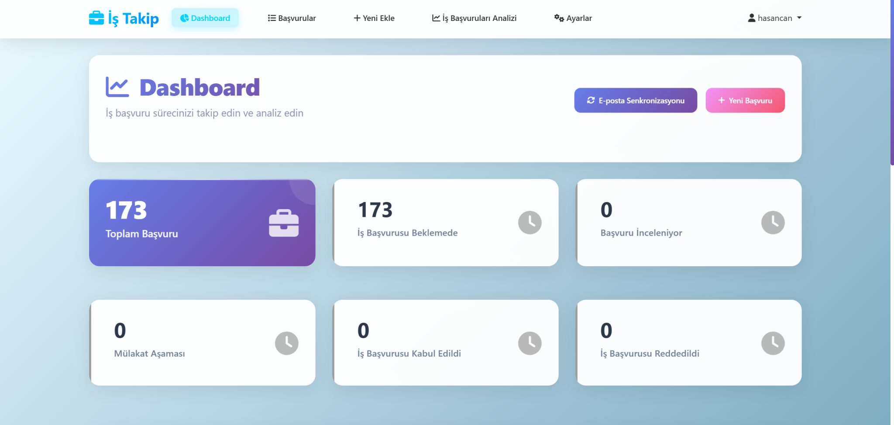
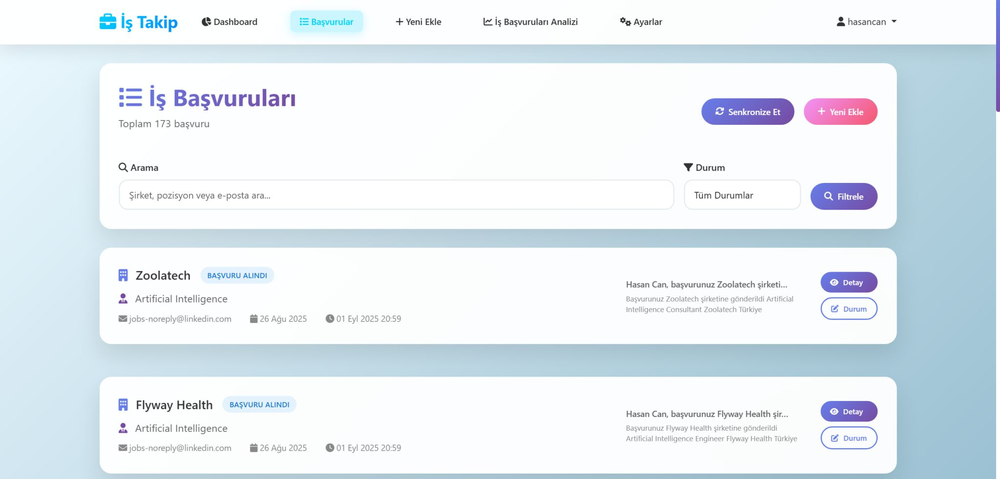
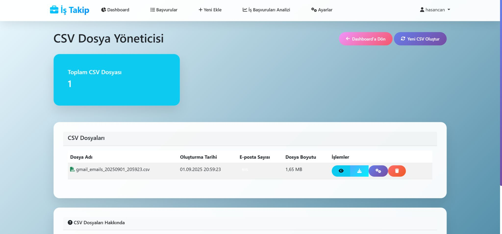

# 🚀 Job Tracker Project  

**Your job applications, smarter and more organized.**  
Automatically track your job applications from Gmail, analyze them with **Gemini 2.0 Flash**, and visualize every step of your career journey — from “Application Received” to “Offer Accepted.”  

---

## 🌟 Overview  

The **Job Tracker Project** is an intelligent job application management system designed to simplify the way users track and analyze their job search progress.  

Instead of manually maintaining messy Excel sheets, this system automatically syncs with your **Gmail**, extracts job-related emails, classifies them, and presents detailed analytics through an interactive **Django dashboard**.  

> “No more lost job applications — stay in control with automation, analytics, and smart insights.”

---

## 🧠 Key Features  

### ✉️ Gmail Integration  
- Connect your Gmail account using the **Gmail API** (requires `credentials.json` file).  
- Automatically fetch and scan incoming/outgoing job-related emails.  

### 🤖 Gemini 2.0 Flash Analysis  
- Uses **Gemini 2.0 Flash** to extract company details, classify email types, and determine job status.  
- Classifications include: *Under Review, Interview, Accepted, Rejected, Waiting for Response*, etc.  

### 📊 Visual Analytics Dashboard  
- View application counts, trends, and company-wise success rates.  
- Monitor weekly and monthly activity with insightful charts.  

### 📝 Application Management  
- Filter, edit, or delete job applications directly from the UI.  
- Export and import data as **CSV files** for easy backup.  

### ⚙️ Custom Settings  
- Adjustable scanning intervals.  
- Gemini API key management and mail analysis limits.  

---

## 🧩 System Architecture  

```text
Gmail API → Gemini 2.0 Flash → Django Backend → PostgreSQL/CSV Storage → Dashboard Visualization
````

---

## 💻 Technologies Used

| Category          | Tools & Frameworks   |
| ----------------- | -------------------- |
| Backend           | Django, Python       |
| Frontend          | HTML, CSS, Bootstrap |
| AI / NLP          | Gemini 2.0 Flash     |
| Email Integration | Gmail API            |
| Data Management   | CSV, Pandas          |
| Visualization     | Chart.js / Plotly    |
| Authentication    | OAuth 2.0            |

---

## 🖼️ Screenshots

### 📊 Dashboard



### 📝 Applications Page



### 📂 CSV Manager



---
 

## 📈 Example Statistics

| Status               | Count |
| -------------------- | ----- |
| Application Received | 7     |
| Interview            | 3     |
| Accepted             | 1     |
| Rejected             | 2     |
| Pending              | 4     |

**Last Scan:** 42 emails
**Detected Job Applications:** 12

---

## ⚙️ How It Works

1. Connect your **Gmail account** and upload your `credentials.json`.
2. Configure scanning interval and analysis limits.
3. Gemini automatically analyzes and classifies your job-related emails.
4. View, filter, and visualize all data from your **dashboard**.
5. Export your results as **CSV** for detailed tracking or sharing.

---

## 🧩 Example Settings

| Setting         | Description                   | Example         |
| --------------- | ----------------------------- | --------------- |
| Gemini API Key  | Authentication for analysis   | *************** |
| Mail Scan Range | Days to include in scan       | 30 days         |
| Analysis Limit  | Max number of emails per scan | 200             |

---

## 🧠 Insights & Analytics

* **Status Distribution** (Accepted / Rejected / Interview / Waiting)
* **Monthly Application Trends**
* **Top Companies Applied**
* **8-Week Activity Overview**

---

## 🛠️ Installation & Setup

### 1️⃣ Clone the repository

```bash
git clone https://github.com/HasanCan6241/job_tracker_project.git
cd job_tracker_project
```

### 2️⃣ Install dependencies

```bash
pip install -r requirements.txt
```

### 3️⃣ Set up environment

* Add your Gmail `credentials.json` file.
* Set your Gemini API key in `.env` file.

### 4️⃣ Run the server

```bash
python manage.py runserver
```

Then open `http://127.0.0.1:8000/` in your browser.

---
## 🪪 License

This project is licensed under the **MIT License**.
Feel free to use, modify, and share it with attribution.

---

> 💡 “Transform your job search into a data-driven experience — powered by AI.”
